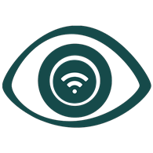

# WI-Feye

<p align = center>

</p>
<p align = center>
    <font size = 2>  
        <a href="https://github.com/PFasano99/">Paolo Fasano</a>, 
		<a href="https://github.com/xiaoli98">Malio Li</a>, 
		<a href="https://github.com/0xfederama">Federico Ramacciotti</a>, 
		<a href="https://github.com/GeremiaPompei">Geremia Pompei</a>,
		<a href="https://github.com/">Giuseppe Lombardi</a>, 
		<a href="https://github.com/Sopralapanca">Giacomo Carfì</a>, 
		<a href="https://github.com/domferr">Domenico Ferraro</a>,
		<a href="https://github.com/jacons">Andrea Iommi</a>,
		<a href="https://github.com/dufnill">Davide Fiorini</a>,
		<a href="https://github.com/paololanza">Paolo Lanza</a>,
		<a href="https://github.com/dookie182">Francesco Kotopulos De Angelis</a>,
		<a href="https://github.com/Erriquez97">Domenico Erriquez</a>,
		<a href="https://github.com/">Domenico Tupputi</a>      
    </font>
</p>

---

</font>

## Quick start: 


The following section of the document is a guide to install and clone this project.


### Download this repository
```
git clone --recursive https://github.com/wi-feye/wi-feye.git
```
--- 

### Update the repository with all submodules
```
git submodule update --remote
git add --all
git commit -m "message"
git push
```

### Run the app
```
docker-compose up --build
```
---

## Contact information

If you have any problems to instal this repository or need any clarification on the code please contact us at: 

|Author                 |University Mail                |Role       |Github                                                             |
|-----------------------|-------------------------------|-----------|-------------------------------------------------------------------|
| Malio Li              | m.li6@studenti.unipi.it       |AI  | <a href="https://github.com/xiaoli98">Malio Li</a>                |
| Giuseppe Lombardi     |g.lombardi11@studenti.unipi.it            |AI  | <a href="https://github.com/">Giuseppe Lombardi</a>               |   
| Giacomo Carfì         | g.carfi1@studenti.unipi.it            |AI  | <a href="https://github.com/Sopralapanca">Giacomo Carfì</a>       |
| Andrea Iommi          | a.iommi2@studenti.unipi.it            |AI  | <a href="https://github.com/jacons">Andrea Iommi</a>              |
| Domenico Ferraro      | d.ferraro7@studenti.unipi.it            |Frontend & Backend  | <a href="https://github.com/domferr">Domenico Ferraro</a>         |
| Geremia Pompei        | g.pompei2@studenti.unipi.it   |Frontend & IoT   | <a href="https://github.com/GeremiaPompei">Geremia Pompei</a>     |
| Domenico Tupputi      | d.tupputi1@studenti.unipi.it            |Frontend & IoT  | <a href="https://github.com/">Domenico Tupputi</a>                |
| Paolo Fasano          | p.fasano1@studenti.unipi.it   |Backend    | <a href="https://github.com/PFasano99/">Paolo Fasano</a>          |
| Federico Ramacciotti  | f.ramacciotti4@studenti.unipi.it            |Backend    | <a href="https://github.com/0xfederama">Federico Ramacciotti</a>  |
| Davide Fiorini        | d.fiorini@studenti.unipi.it   |Backend    | <a href="https://github.com/dufnill">Davide Fiorini</a>           |
| Paolo Lanza           | p.lanza1@studenti.unipi.it    |Backend    | <a href="https://github.com/paololanza">Paolo Lanza</a>           |
| Francesco Kotopulos De Angelis |   f.kotopulosdeange@studenti.unipi.it |Backend    | <a href="https://github.com/dookie182">Francesco Kotopulos De Angelis</a> |
| Domenico Erriquez     | d.erriquez@studenti.unipi.it  |Backend    | <a href="https://github.com/Erriquez97">Domenico Erriquez</a>     |

             
        
